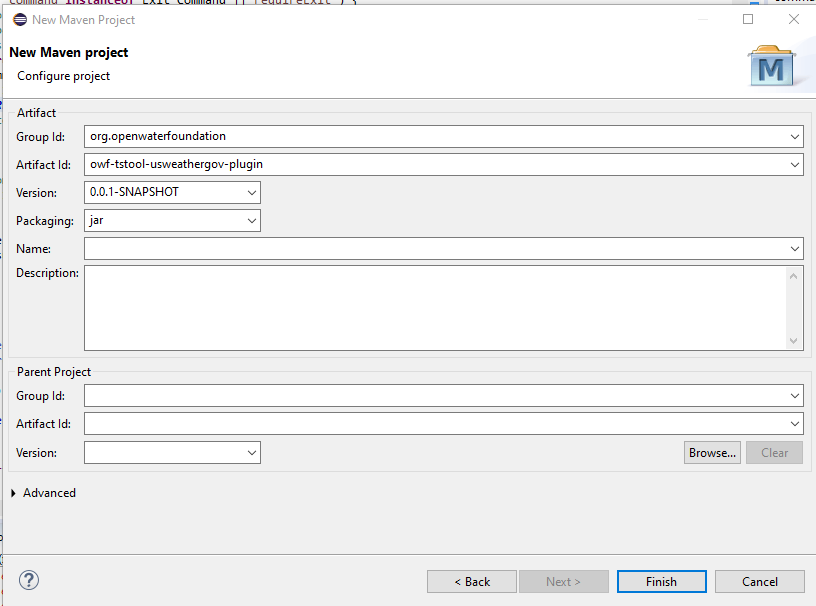

# Setting up the usweathergov Plugin

This documentation explains how to initialize the TSTool `usweathergov` (US `weather.gov`) plugin.
This is typically only done once during initial setup,
and then the repository can be added to the TSTool Eclipse workspace using the instructions in the
main repository [`README.md`](../README.md) file.

## Initialize the Repository ##

Create the GitHub public repository `owf-tstool-usweathergov-plugin`.

Clone to the `TSTool/git-repos` folder on the computer.

Copy the `README.md`, `.gitignore`, `.gitattributes`, `build-util/`, and `doc-init/` files from the `owf-tstool-timesheetscom-plugin` repository.
Update all the files to replace `timesheetscom` references with `usweathergov` references, and other similar changes.

## Add Maven Project to Eclipse ##

Start the TSTool Eclipse environment by running the `cdss-app-tstool-main/build-util/run-eclipse-win64.cmd` command file
from a Windows command shell.

Use the Eclipse ***File / New / Project... / Maven / Maven Project***.  Specify information as shown in the following image.
Redundant `owf-tstool-usweathergov-plugin` folders are used, one for the Git repository folder working files,
and one for the Maven project with source files.
Create the new folder using the selector dialog if it does not exist.
This allows other top-level folders to be created in the repository to separate major development files, including documentation and tests.

Press ***Next >***.  Fill out the new maven project artifact properties as follows:

Press ***Finish***.

The project will be shown in Eclipse and folders and files will be initialized for the Maven project.

Next, copy files from other similar plugins to implement the functionality.
The `build-util` scripts can be used to create the plugin `jar` file and run the plugin during development.
